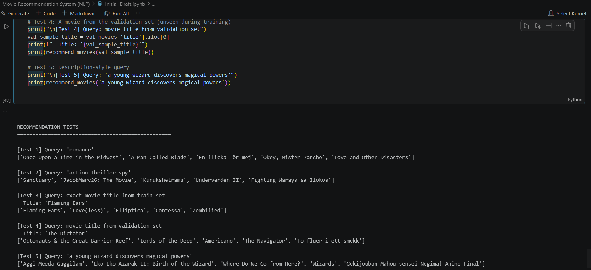

# Content-Based Movie Recommendation System

**Dataset:** jquigl/imdb-genres (Hugging Face) \
**Language:** Python \
**Method:** TF-IDF + Cosine Similarity

---

## Setup Instructions

### 1. Clone the repository

```bash
git clone https://github.com/Shraddha6211/Movie-Recommendation-System-NLP-.git
cd Movie-Recommendation-System-NLP-
```

### 2. Create a virtual environment:

```bash
python -m venv venv
```

Activate it:

- On macOS/Linux:

```bash
source venv/bin/activate
```

- On Windows:

```bash
venv\Scripts\activate
```

### 3. Install dependencies

```bash
pip install -r requirements.txt
```

### 4. Download NLTK stopwords

```python
import nltk
nltk.download('stopwords')
```

---

## Explanation of Approach

### How it works

This is a content based movie recommendation system. It recommends movies by comparing the text content of movies tto find similar ones. It only relies on input text. Other parameters like ratings and watch history are not taken in consideration.

**Systems workflow:**

- **Text preparation:** Clean and combine the `description`, `genre` and `expanded-genres` fields to one field called `tags`.
- **Vectorization**: Converts each words from `tags` field into numbers using TF-IDF for the computer to compare them.
- **Similarity**: Input text (free-text/ genre/ movie title), returns 5 mpvies with most similar numbers using cosine similarity.

### Preprocessing choices

**Why combine fields?**
`description + genre + expanded-genres`
The description field alone might not have genre keywords. `genre` and `expanded-genres` fields are combined so that the model has more signal to find similar movies. eg: Movie title might not have 'romance' keyword but genre and expanded genre will have these key words.

**Why clean text?**
`Lowercase + remove punctuation`
'Romance' and 'romance' are two same words with same meaning only different casings. The model treats them differently. Lowercasing ensures consistent matching.
Punctuation does not contribute in similarity at all so its removal can help reduce memory usage.

**Why separate title and year?**
`title - year`
Year has no contribution in the recommendation logic and excluding it slightly improves speed and reduces processing noise.

**Why remove common words?**
`Remove stopwords`
Words like 'the', 'a', 'is' appear in every movie description. They add noise without any contributtion to recommendation logic. Makes comparision meaningful.

**Why stem?**
`Porter Stemming`
Stemming reduces words to their root forms. Like 'availability', 'available' are stemmed to words like 'availabil', 'availabl'. The characters like `-ity`, `-tion`, `-s`, `-ies` are stemmed from the words so different forms of the same word are treated as one.

---

### Why TF-IDF over BoW?

Bag-of-Words (BoW) counts how often each word appears, but common words (e.g., film, story) get high importance even though they don’t help distinguish items.

TF-IDF reduces the weight of common words and increases the weight of rare, meaningful ones.

**Example:**

- Word `story` appears in 5000 movies: **low TF-IDF score**
- Word `wizard` appears in 50 movies: **high TF-IDF score**

---

## Metrics for Evaluation

Since there’s no user feedback data, recommendations are evaluated using manual inspection.

**How it is done:**

- Pick a movie and review its recommendations
- Check if results share similar genre, theme, or mood with the input movie

**Example:**

- If a Horror movie returns mostly Horror recommendations; good
- If it returns unrelated genres; needs improvement

This is called **qualitative evaluation** (judging by inspection, not numbers).

**Precision@5**
Another way to think about quality is Precision@5. It asks: out of the 5 movies recommended, how many actually share a genre with the movie searched for?

> If 4 out of 5 recommendations match the genre of the input movie:  
> **Precision@5 = 4 / 5 = 0.8 (80%)**

A score of 1.0 means all 5 recommendations were relevant. A score of 0.0 means none were.

---

## Limitations

- **No personalization:** Same input always gives the same output regardless of who is asking.
- **No word context:** The system does not understand that 'not good' is the opposite of 'good'. Only individual word frequencies matter and sentence meaning is ignored.
- **Cold start problem:** New movies not present in the training data may not be recommended well.
- **No learning:** The system does not improve from user interactions or feedback.
- **Basic evaluation:** Relies on manual checks rather than robust automated metrics.
- **Description quality:** Missing or poor descriptions reduce recommendation quality.

---

## Improvements

- **Better accuracy | Use sentence embeddings:**  
  Models like BERT capture meaning and context, not just word overlap, leading to more relevant recommendations.

- **Better signal | Weight important features:**  
  Give higher importance to movie descriptions over genre tags to make recommendations more story-driven.

- **Better personalization | Add collaborative filtering:**  
  Combine content-based results with user behaviour (e.g. "users who liked this also liked…").

- **Better text processing | Use lemmatization:**  
  Produces cleaner, real words compared to stemming (e.g. 'running' - 'run' instead of 'runn'), improving feature quality.

- **Better scalability | Use approximate nearest neighbors:**  
  Tools like FAISS speed up similarity search, making the system efficient for large datasets.

---

## Outputs

Screenshot of the output


